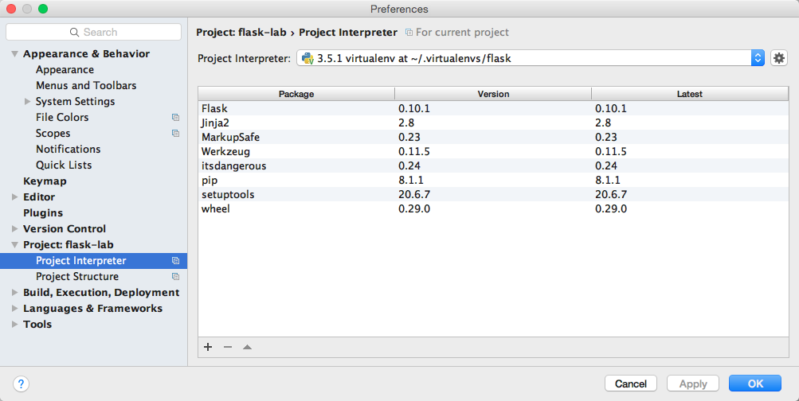
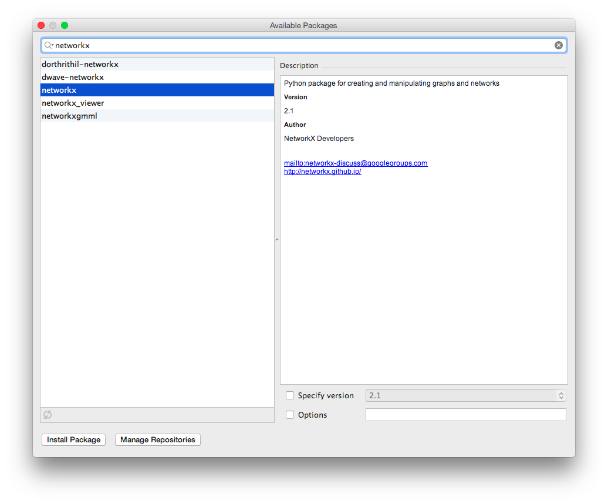

# Installing Python Packages in PyCharm

In PyCharm, open the Preferences/Settings window, then go to Project > Project Interpreter. You should see a screen that looks like this:

On the bottom, click on the plus (+) sign, then search for your Python package. For this set of instructions, we will use the `networkx` package. The description should read "Python package for creating and manipulating graphs and networks".

Click "Install Package"; once it says "Package 'networkx' installed successfully", close both windows.
